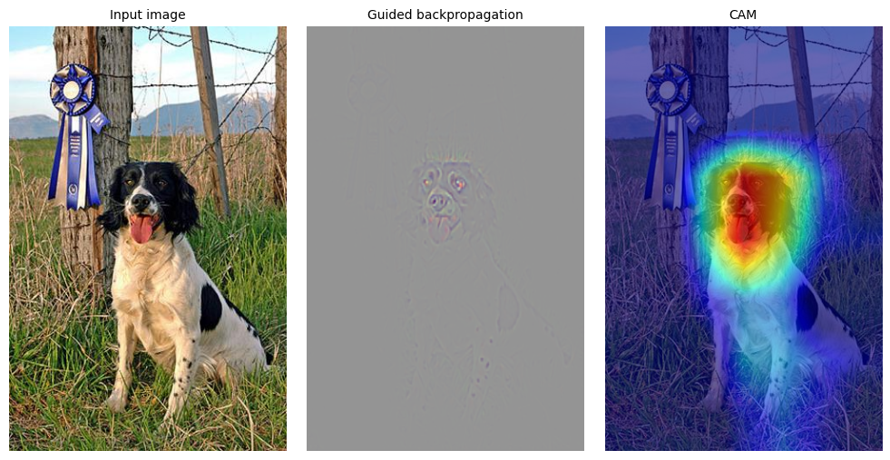

Deep Learning Research Paper Implementations

This repository contains implementations of various deep learning related papers. Each notebook contains a brief summary of the paper, the implementation of the proposed model or technique, and some discussions/experiments on the obtained results.

## Torch Basics

## FSRCNN

## Brain Tumor classification

## Grad CAM

[Link to the article](Articles/gradcam.pdf)

    

